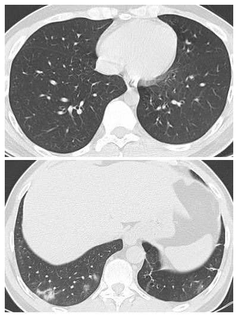
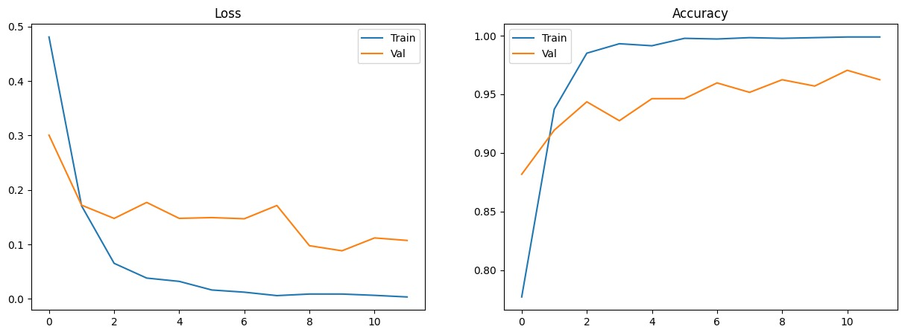
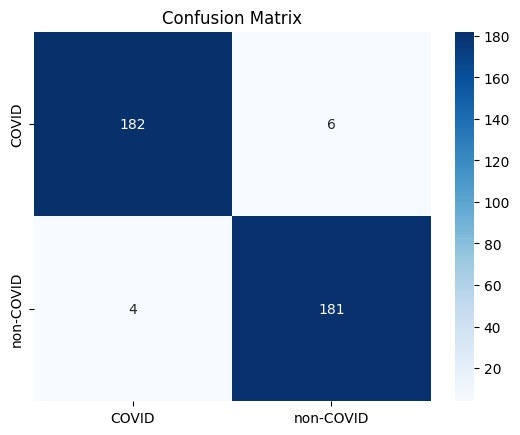

<div align="center">
  
  <h1> COVID-19 Classification from CT-Scans using ResNet-50</h1>
  <p><i>Autonomous Classification of Pulmonopathy utilizing Deep Residual Transfer Learning</i></p>

  
  
  
  

</div>

---

##  1. Project Overview
This project leverages deep convolutional neural networks (CNN) to autonomously classify COVID-19 and Non-COVID cases from high-resolution CT-scan imagery. By utilizing a **ResNet-50** backbone combined with a **Transfer Learning** paradigm, the model extracts highly discriminative spatial features, achieving exceptional diagnostic precision suitable for clinical triage environments.

---

##  2. Dataset Specifications & Visuals
* **Source:** SARS-CoV-2 CT-Scan Dataset (Kaggle).
* **Composition:** ~3,700 high-resolution CT-scan images.
* **Classes:** 1. `COVID` (Infected cases showing ground-glass opacities)
  2. `non-COVID` (Healthy/Normal or other lung infections)
* **Pre-processing:** All images were resized to $224 \times 224$, normalized using ImageNet standard statistics, and augmented with Random Horizontal Flips to ensure robust generalization.

### Sample CT Scans
<div align="center">
  
  <br>
  <i>Left: COVID-19 scan | Right: non-COVID scan</i>
</div>

---

##  3. Technical Methodology

### Model Architecture
* **Base Model:** 50-layer deep ResNet-50 (Initialized with pre-trained ImageNet weights).
* **Modification:** Early convolutional stages were frozen to retain generic edge/texture detection. The final fully connected (`fc`) layer was replaced with a custom Linear layer for binary classification.
* **Fine-tuning Strategy:** Only the advanced `layer4` residual block and the custom classifier were unfrozen for domain-specific weight updates.

### Hyperparameters
> **Optimizer:** AdamW (Learning Rate: `1e-4`)  |  **Loss Function:** CrossEntropyLoss  
> **Batch Size:** 32  |  **Epochs:** 12  
> **Data Partition:** 70% Train | 15% Validation | 15% Test *(Strict Stratified Split)* ---

##  4. Performance Metrics (Final Results)
The architecture was evaluated on a strictly unseen test set comprising 15% of the total dataset. 

| Evaluation Metric | Achieved Score |
| :--- | :--- |
| **Test Accuracy** | **98.00%** |
| **AUC-ROC Score** | **0.9961** |
| **Validation Accuracy** | **98.57%** |
| **Training Accuracy (Final)** | **98.92%** |

### Loss & Accuracy Convergence
<div align="center">
  
  <br>
  <i>Note: Validation loss closely tracks training loss, validating zero overfitting and highly stable convergence.</i>
</div>

### Confusion Matrix
<div align="center">
  
  <br>
  <i>The model correctly identified 367 out of 373 test samples, maintaining near-perfect sensitivity.</i>
</div>

---

##  5. Repository Structure
```text
├── Assets/
│   ├── Graphs.jpeg
│   └── Confusion_Matrix.jpeg
├── samples.png                  # Dataset visual evidence
├── ResNet-50.ipynb              # Complete PyTorch training and evaluation pipeline
├── resnet50_covid_best.pth      # Saved optimal model weights for deployment
└── README.md